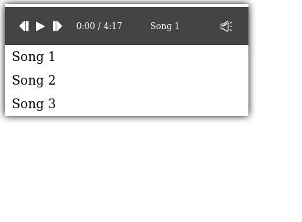

# Vanilla Audio player
  
## Introduction
 
##### This audio player is small javascript library used to play tracks and playlists. It's a snap to setup and works on all modern browsers.Supports all major browsers (Google Chrome, Firefox, Safari, IE 11, Edge)  
  
## Installation  
  
#### install package:
  
`npm i vanilla-audio-player`
  
#### Import package into your JS file as ES6 module:
  
`import AudioPlayer from 'vanilla-audio-player'`
  
#### Use Audio player: 
 
`new AudioPlayer('your-selector', tracks, options);`


```
new AudioPlayer('.player-1',[    
   {    
      name: 'Song 1',    
      src: '/url/to/your/file.mp3'    
   },    
   {    
      name: 'Song 2',    
      src: '/url/to/your/file.mp3'    
   },    
   {    
      name: 'Song 3',    
      src: '/url/to/your/file.mp3'  
 } ], options);
```
  
#### Use Vanilla lightbox styles (scss):
`@import "~vanilla-audio-player/src/scss/app.scss";`
  
#### HTML markup:  
##### 'audio-player' class is used for styles from scss file

`<div class="audio-player player-1"></div>`
  
## Options
  
| Name  | Meaning  |
|--|--|  
| autoplay | Sets autoplay for player (only works if user have already interacted with site) |
| trackList | Adds track list to player |
  
  
## Track Options
  
| Name  | Meaning  |
|--|--|
| name | Your song title that will be shown in player |
| src | Url to your audio file |

## Functions  
  
| Name  | Meaning  |  
|--|--|  
| destroy() | Destroy AudioPlayer instance |  



